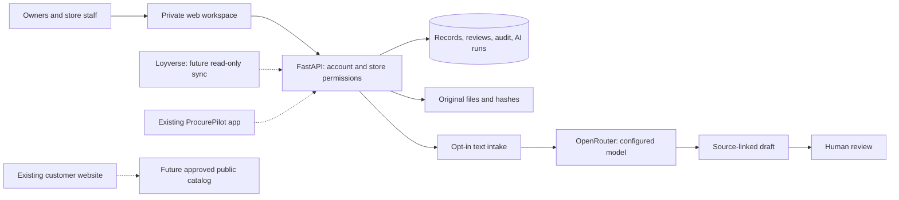

# Architecture · foundation 0.1

## Decision

Use a portable modular application: **React + TypeScript + Vite**, **FastAPI**, and **SQLite WAL + a private file volume**. The frontend and API are served from one origin in production. A single Docker container can sit behind HTTPS on a small VPS; hosting has not been selected or purchased. SQLite is appropriate for this bounded pilot with one API process. Multi-instance workers or unrelated customer businesses require a database and tenancy design before scaling.

The foundation is evidence, explicit permissions, and durable state. A model runner is an interchangeable component. Model conversational memory is not the business database.

Solid connections exist in this repository, although external AI is disabled until configured. Dotted connections are planned, not live.

## Implemented entities

- `users`: separate credentials, role, assigned store IDs.
- `sessions`: hashed opaque tokens, 12-hour expiry; HttpOnly/SameSite cookies and HTTPS-only cookies in production.
- `entries`: immutable original note, category, store, source date, submitter, timestamp, request key, review version.
- `attachments`: original bytes under random IDs outside public assets, safe download name, SHA-256, length, parent entry.
- `audit`: actor, action, subject, timestamp; application append-only history in the pilot (not a tamper-proof accounting audit system).
- `ai_runs`: actor, source digest, selected model, call reservation, draft/failure state, source-linked output.

Runtime data is not tracked in Git. Source code, product decisions, prompts, architecture, and project continuity are versioned. No default production credentials and no public signup.

## Permissions

| Capability | Technical owner | Manager / Moritz | Staff |
| --- | --- | --- | --- |
| Submit note or original | Assigned stores | Assigned stores | Assigned stores |
| Read collection and download files | Assigned stores | Assigned stores | Own submissions in assigned stores |
| Review / reopen review | Yes | Assigned stores | No |
| Request/read AI intake draft | Assigned stores | Assigned stores | No |
| Export collection index | Yes | No | No |
| Full audit | Yes | No | No |
| Accounts, credentials, deployment | Server administration | No | No |

An entry tagged Both stores is visible only to accounts assigned to both. UI role hiding is backed by API authorization. Separate organizational tenancy has not been implemented.

## Agent execution model

The first specialist is a bounded text extraction call. No general-purpose agent shell runs on uploaded documents. Inputs are untrusted, outputs follow a validated schema, quotes must appear in the supplied source, and drafts never cause operational writes. A human explicitly starts each call. The model has no tools. Notes plus UTF-8 TXT/CSV/TSV content are limited to 18,000 characters; some long sources can be truncated. Binary documents are stored but not sent. Results are cached per entry/source/model. Running requests older than two minutes are marked failed on the next extraction attempt so interrupted work can be retried. Retries can consume a second call if the earlier provider outcome was uncertain.

The default reservation cap is 20 calls per UTC day, clamped to 0–100 by server configuration; output is capped at 2,048 tokens. This is not a PHP/USD spend limit. Configure the provider key’s monetary budget as well. Never print or store provider exception bodies in operational errors. Real model quality, latency, and costs still need evaluation.

Departments to add incrementally: coordination, finance, stock/procurement, customer support, growth. Their responsibilities and promotion gates are in `docs/AGENT_DEPARTMENTS.md`. Do not deploy six free-running agents just to fill the org chart.

## Existing projects

`D:/CODING/LOYVERSE` is ProcurePilot PH: FastAPI/Python, React/TypeScript, SQLite, forecasting/optimization, safe marketplace handoff, approvals, receiving, backup/restore, and an Android shell. Its saved PROJECT_STATE claims extensive completed testing and identifies live Loyverse access, ten real mappings, and Android verification as remaining blockers. These claims were read, not independently rerun. This repository does not import its database or trust its release status as live data.

Keep ProcurePilot separate initially. Define a versioned read-only boundary for product/store mappings and freshness; verify its contracts against the actual account; then surface recommendations as links or API views. Avoid two services writing the same SQLite file. Avoid duplicating marketplace checkout or silently changing its already documented execution rules.

`D:/CODING/SAUSAGE` is the Next.js customer site. It strips buy/sell prices, margins, and internal notes from its public product representation. Preserve this public/private boundary. Later supply a separately approved public projection with real availability freshness. Public browsers must never query the private collection API.

## Financial truth that comes later

Revenue reports are reported observations until reconciled. Unknown costs, days, stock quantities, and tax rules stay unknown. Never show a missing value as zero or imply sales minus purchases equals profit.

A future ledger needs distinct store/location/product/variant identities; immutable POS receipts and refunds; inventory movements with units, batch/expiry, wastage, transfers, and in-house production yields; purchase receipts versus supplier payments/payables; overhead by period and documented allocation; cash/bank movements; opening balances; and accountant-confirmed tax treatment. Represent money in integer minor units or exact decimals, never floating-point arithmetic. Represent weight/quantity with explicit base units and pack conversions.

Sales, cash received, COGS, purchases, payments, profit, and cash flow are different measures. Transfers do not create revenue. Investor funding does not create sales. Reconciliation and source coverage must accompany any profitability chart. Keep tax and investor arrangements configurable and reviewed by qualified local professionals; no rates or legal structure are hardcoded.

## Operational boundaries and limitations

- No offline persistence: an in-progress form survives a failed request while the page remains open, but not a reload. Clear save confirmation is required. Offline capture/PWA is a later feature.
- Request idempotency prevents retries duplicating the same submission; it does not reconcile two independently entered reports for the same day.
- Original media is downloaded as an attachment, not executed or rendered as trusted HTML. No malware scanning or OCR has been implemented.
- Password resets are an owner-run server command. No email service, self-service reset, MFA, or SSO yet.
- Same-origin checks plus a custom request header protect state-changing endpoints; no wildcard CORS. Local server binds to loopback. Production requires HTTPS origin configuration.
- Backup uses SQLite’s snapshot API and the attachments referenced in that snapshot. Backups contain sensitive business/account information and require protected off-host storage and an actual restore drill before live use.
